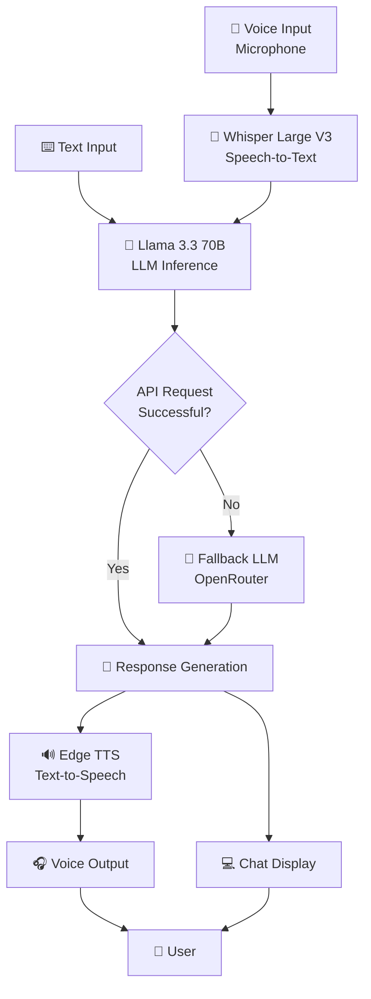

# 🎙️ AI Voice Bot

A personalized AI voice assistant built using **Streamlit**, **Groq**, **Whisper**, **Llama 3.3 70B**, and **Edge TTS**. The application enables natural voice conversations by converting speech into text, generating intelligent responses, and delivering synthesized voice replies in real time.

---

## 🚀 Features

- 🎤 Supports both voice and text interaction
- 📝 Speech-to-text transcription using Whisper Large V3
- 🧠 Conversational AI powered by Llama 3.3 70B
- 🔊 Text-to-speech responses using Edge TTS
- 💬 Multi-turn conversation memory
- 🗑️ Conversation reset functionality
- ⚡ Fast and lightweight Streamlit interface

---

## 🛠️ Tech Stack

- Python
- Streamlit
- Groq API
- OpenRouter API
- Whisper Large V3
- Llama 3.3 70B Versatile
- Edge TTS

---

## 🏗️ System Architecture



---

## Installation

```bash
pip install -r requirements.txt
```

Create a `.env` file:

```env
GROQ_API_KEY=your_api_key_here
OPENROUTER_API_KEY=your_openrouter_api_key_here
```

Run the application:

```bash
streamlit run app.py
```

---

## 📌 How It Works

- Record your voice.
- Whisper converts speech to text.
- Llama 3.3 generates a response.
- Edge TTS converts the response into speech.
- The bot replies with both text and voice.

---